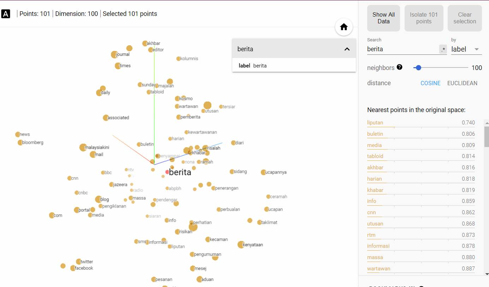

Malay Word Vectors (word2vec on Malay Wikipedia - http://ms.wikipedia.org)

One key idea in Natural Language Processing is that words can be modelled as multi-dimensional numerical vectors, which can be fed in the other classical machine learning algorithms (classification, neural networks etc). These vectors, also known as "word embeddings" are produced using the Word2Vec model. The projector.tensorflow.org is used to visualised these higher-dimensional vectors by reducing it into 3-dimensional space. This site also allows the user to find words that are similar to one another.
 

Ref: https://www.tensorflow.org/tutorials/representation/word2vec
